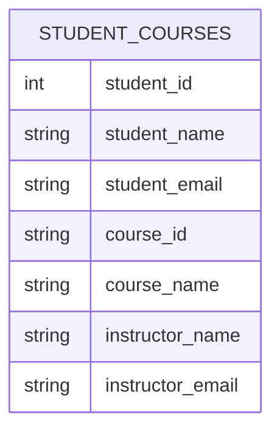
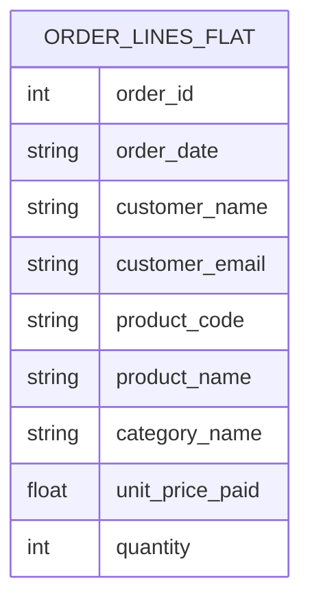

# Overview

This folder holds the information pertaining exploration of database designs.

# General information

Hereunder is a verbatim of the markdown source of project overview's page (unavailable if no auth)

https://intranet.hbtn.io/projects/3984

<details>
<summary><b>Project presentation</b></summary>
## Introduction 
Until now, you have mostly worked with SQL as a language for **querying** and **modifying** data.

In this project, the focus changes.  
You will now study a different question:

&gt; How should data be structured so that it remains clear, consistent, and maintainable over time?

A database can work and still be badly designed.  
Poor designs often seem acceptable at first, but later they create problems such as:

- duplicated data,
- inconsistent updates,
- unnecessary complexity,
- loss of information after deletes,
- difficulty extending the system.

This project is designed as a **debugging and redesign lab**.  
Instead of starting from a correct schema, you will receive tables that already exist and that already contain data. Your task is to study them, identify why they are problematic, and redesign them in a better way.

---

## SQL, the Relational Model, and Why Design Matters

A relational database organizes information into **tables**.  
Each table contains:

- **rows**, which represent individual records,
- **columns**, which represent attributes of those records.

Good relational design is not only about storing data. It is about storing it in a way that avoids redundancy and inconsistent dependency. Microsoft Learn describes normalization as the process of organizing data into tables and relationships to protect data and make the database more flexible by eliminating redundancy and inconsistent dependency. Redundant data wastes space and creates maintenance problems. 

[Microsoft Learn — Database normalization description](/rltoken/GIQyChObRx9IfPzUb04JHQ)

A common practical target is **Third Normal Form (3NF)**. A standard summary is:

- **1NF**: values should be atomic and repeating groups should be removed,
- **2NF**: non-key attributes should depend on the whole key,
- **3NF**: non-key attributes should not depend on other non-key attributes.  
  [Redgate — Normalization in Relational Databases](/rltoken/T71VMxqtVMnhu-xCPmAMTA)

You do not need to memorize formal definitions before starting. In this project, you will reach those ideas by observing problems in real tables.

---

## Why SQLite is Used in This Project

You will use **SQLite** for the practical tasks.

SQLite is a lightweight relational database engine that stores data in a single local file and requires no separate server process. That makes it convenient for learning and for small experiments. 

[SQLite — About / documentation](/rltoken/vgCyE6poAg2KtBeVzYW_cw)

At the same time, you should understand that SQLite is being used here for **convenience**, not because it represents every production database. In real systems, teams often use more robust systems such as PostgreSQL, MySQL, Oracle, or SQL Server, especially when they need:

- stronger multi-user concurrency,
- more operational tooling,
- advanced security and user management,
- more detailed performance tuning features.

Also note an important SQLite-specific behavior: foreign key enforcement is available, but it is **disabled by default** unless enabled for each connection. 

[SQLite — Foreign Key Support](/rltoken/uH6F_1IyWD0qHljFe9jttA)

For this project, however, the main focus is **design reasoning**, not RDBMS-specific behavior.

---

## Learning Objectives

By the end of this project, you should be able to:

- identify data redundancy in a schema,
- explain update, insert, and delete anomalies,
- redesign a table into a set of better tables,
- apply the ideas behind 1NF, 2NF, and 3NF,
- distinguish between a table that stores data and a table that represents a relationship,
- justify design decisions clearly,
- discuss trade-offs with other students.

---

## Provided Files

For this project you will use the following dataset: `https://github.com/hbtn-edu/public_resources/tree/main/3984-db_design`

The dataset includes several intentionally problematic tables.  

You will use them to:

1. inspect the current state,
2. run small SQL operations to observe what goes wrong,
3. propose a better schema.

### Important

You are **not** expected to repair the existing tables in place.

In most tasks, you are expected to:

- create **new tables**,
- define keys and relationships,
- redesign the structure.

---

## General Requirements

- Use **SQLite** for the practical work.
- You may inspect and experiment with the provided tables.
- You may run `SELECT`, `UPDATE`, `INSERT`, or `DELETE` statements when the task explicitly asks you to observe a problem.
- Your main deliverable in each practical task is the **new schema design**.
- When appropriate, include a **Mermaid ER diagram** to communicate your solution.
- The practical tasks use a **self-check checklist** instead of automatic correction.
- The project ends with a **timed one-shot quiz**.

---

## Peer Learning Expectations

This project is well suited to peer discussion because more than one schema can sometimes be acceptable.

You are encouraged to compare your design with another student’s design and discuss:

- which anomalies were eliminated,
- whether any redundancy remains,
- whether a table has a clear responsibility,
- whether the design can support future changes.

The goal is not only to produce a correct answer, but to understand **why** a good design is better and what problems appear later when the design is poor.

---

## Suggested Workflow

For each task:

1. Read the scenario carefully.
2. Inspect the provided data.
3. Run the suggested exploratory queries.
4. Observe what problem appears.
5. Redesign the schema.
6. Validate your own work using the self-check checklist.
7. Compare and discuss your design with another student.

---

## Resources for Further Study

Use these resources if you want to deepen your understanding during the project:

- [Microsoft Learn — Database normalization description](/rltoken/GIQyChObRx9IfPzUb04JHQ)
- [Redgate — Normalization in Relational Databases: 1NF, 2NF, 3NF](/rltoken/T71VMxqtVMnhu-xCPmAMTA)
- [Redgate — How to Normalize a Database into 2NF and 3NF](/rltoken/a5zuDiL7LdjENF5MNX5xoQ)
- [SQLite — CREATE TABLE](/rltoken/oZYTwbRe85y981C2t7kYGw)
- [SQLite — Foreign Key Support](/rltoken/uH6F_1IyWD0qHljFe9jttA)

</details>

# Provided database information - Database Design & Normalization Lab — Student Package

This is for practicity a verbatim of the information from the provided database's github project which can be found at https://github.com/hbtn-edu/public_resources/tree/main/3984-db_design


<details>
<summary><b>Database structure overview</b></summary>
## Overview

This package contains the dataset used in the **SQL: Database Design & Normalization** project.

## Files

- `dataset.db` — SQLite database file with all tables needed for the project
- `dataset.sql` — SQL script used to create and populate `dataset.db`

## Tables included

### 1. `student_courses`
Used in **Task 0**.

Why this table is intentionally problematic:
- the same student information appears in multiple rows
- the same course information appears in multiple rows
- the same instructor information appears in multiple rows

Typical anomalies you can observe:
- **update anomaly**: changing an instructor requires multiple updates
- **insert anomaly**: adding a new course without a student does not fit naturally
- **delete anomaly**: deleting the last enrollment for a course removes course information

### 2. `order_lines_flat`
Used in **Task 1**.

Why this table is intentionally problematic:
- customer data is repeated in every order line
- product data is repeated across many orders
- order-level and line-level data are mixed together

### 3. `employees_departments`
Used in **Task 2**.

Why this table is intentionally problematic:
- department data is repeated for every employee in the department
- department attributes depend on `department_id`, not on `employee_id`

### 4. `conference_registrations_flat`
Used in **Task 3**.

Why this table is intentionally problematic:
- attendee data repeats across multiple sessions
- session data repeats across multiple attendees
- speaker, room, and track data are repeated

## How to use the dataset

You can open the database directly with SQLite-compatible tools, or recreate it from the SQL script.

### Recreate the database from the SQL script
```bash
sqlite3 dataset.db < dataset.sql
```

### Example exploration queries
```sql
SELECT * FROM student_courses;
SELECT * FROM order_lines_flat;
SELECT * FROM employees_departments;
SELECT * FROM conference_registrations_flat;
```

## Important note

The tables in this package are **not models to imitate**. They are intentionally denormalized so that you can:
- observe data anomalies,
- understand why poor designs create future maintenance problems,
- redesign them into cleaner schemas.

</details>


# Tasks details

## Task 0: Diagnose and Normalize a Broken Academic Schema

<details>
<summary>Overview and instructions</summary>
The table `student_courses` tries to store information about:

- students,
- courses,
- instructors,
- enrollments.

Open the dataset and inspect it:

```sql
SELECT * FROM student_courses;
```

### Current Structure




### Example: Why this design causes problems

#### Update anomaly
Suppose the email for `Dr. Smith` changes.  
Because `Dr. Smith` appears in multiple rows, you must update the same fact many times. If one row is forgotten, the database becomes inconsistent.

Try this on a copy of the data:

```sql
UPDATE student_courses
SET instructor_email = &#39;smith-new@academy.edu&#39;
WHERE course_id = &#39;C101&#39;;
```

Then inspect the instructor rows again:

```sql
SELECT * FROM student_courses
WHERE instructor_name = &#39;Dr. Smith&#39;;
```

Did every occurrence of the instructor change?

#### Insert anomaly
Suppose the school wants to add a new course before any student enrolls in it.  
This table does not naturally support that idea, because the row structure mixes student and course data together.

#### Delete anomaly
Suppose the last enrollment for a course is deleted.  
When the last row for that course disappears, the course and instructor information disappear with it.

### Your task

Redesign this schema so that it is suitable for a relational system.

### Expectations

- You are expected to **create new tables**.
- Your solution should aim to remove the anomalies shown above.
- You should move the design toward **Third Normal Form**.

### Deliverables

- a proposed schema (SQL or diagram),
- optionally, a Mermaid ER diagram,
- a short explanation of why the old table was problematic.

### Self-Check Checklist

Your solution is strong if:

- each table represents a single concept,
- student data is stored once,
- course data is stored once,
- instructor data is stored once,
- enrollments are represented separately,
- changing an instructor email requires one update only,
- deleting an enrollment does not remove course information.

### Discussion Prompt

Compare your solution with another student’s solution.

Discuss:

- Did both of you create a separate instructor table?
- Did both of you create a junction table for enrollments?
- If your solutions differ, which anomalies does each one eliminate?

</details>


## Task 1. Redesign an Order System from a Flat Table

<details>
<summary>Overview and instructions</summary>
The table `order_lines_flat` stores order data, customer data, and product data all together.

Inspect it:

```sql
SELECT * FROM order_lines_flat;
```

### Current Structure




### Example: Why this design causes problems

Suppose the product name for `P200` needs to be updated.

Try this:

```sql
UPDATE order_lines_flat
SET product_name = &#39;Wireless Mouse&#39;
WHERE product_code = &#39;P200&#39;;
```

Now inspect all rows for that product:

```sql
SELECT * FROM order_lines_flat
WHERE product_code = &#39;P200&#39;;
```

You had to update multiple rows to change one product description.

Also notice that customer data is repeated for every order line, and order-level data is mixed with product-line data.

### Your task

Design a better schema for this system, based on the data you see and the following requirements:

- one customer can place many orders,
- one order can contain multiple products,
- one product can appear in many orders,
- each order line records a purchased quantity.

### Expectations

- You are expected to **create new tables**.
- You should separate customer, order, product, and line-item concepts.
- You should think carefully about whether `unit_price_paid` belongs with the product or with the order line.

### Deliverables

- a proposed schema,
- optionally, a Mermaid ER diagram,
- a short justification for where you placed `unit_price_paid`.

### Self-Check Checklist

Your solution is strong if:

- customer data is not repeated across order lines,
- product data is not repeated across order lines,
- order-level data is separated from item-level data,
- quantity is stored at the order-item level,
- you can explain your reasoning about price history.

### Discussion Prompt

Compare your solution with another student’s solution.

Discuss:

- Did both of you keep `unit_price_paid` in `order_items`?
- If one design puts price in `products` only, what historical information is lost?
- Which design is easier to maintain, and why?

</details>
