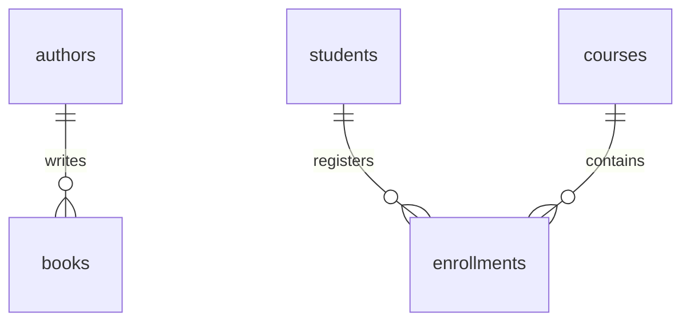

# Overview

This repository will keep information about exploration of joins and relationships

# General information - Joins & Relationships

## Learning Objectives

By the end of this project, you should be able to:

* Understand relationships:

    * 1–1, 1–N, N–N
* Distinguish between:

    * primary key
    * foreign key
* Understand referential integrity (conceptually)
* Write queries using:

    * `INNER JOIN`
    * `LEFT JOIN`
    * `CROSS JOIN`
* Interpret `NULL` values in joins
* Work with junction tables
* Use subqueries in filtering and comparisons

---

## Resources

* [https://www.sqlite.org/lang_select.html](/rltoken/KuGxoEvBgA_WpV3q7BV-Vg)
* [https://www.sqlite.org/foreignkeys.html](/rltoken/2VjpUUywLwa27JDkfSALcA)
* [https://www.sqlite.org/lang_expr.html](/rltoken/tNIP5IrozTss6dHDCvLIgA)
* [https://www.w3schools.com/sql/sql_join.asp](/rltoken/WkSbeLJwVG7nt6Uc3GNElQ)

---


## General Requirements

* Environment:

    * Ubuntu 20.04
    * SQLite 3.x

* Each task:

    * must be a `.sql` file
    * must contain a single query (unless stated otherwise)

* Execution:

    ```
    sqlite3 library.db &lt; file.sql
    ```

* Output must:

    * match expected results exactly
    * include explicit `ORDER BY` when needed

* Do not:

    * modify schema unless instructed
    * use unsupported SQL features

## Important Notes

### 1. Join conditions are critical

A missing or incorrect `ON` condition can produce incorrect results.

### 2. NULL values

In outer joins:

* missing matches → `NULL`
* you must interpret them correctly

### 3. Relationships vs Queries

* Relationships define structure
* Joins reconstruct that structure in queries

### 4. SQLite behavior

* Foreign keys may not be enforced unless enabled
* Some SQL features differ from other databases

&gt; Always focus on writing logically correct SQL, not relying on engine-specific behavior.

SQLite does **not support**:

* `RIGHT JOIN`
* `FULL OUTER JOIN`

These can be simulated, but are not required in this project.


## Final Remarks

This project introduces a key shift:

You are now working with **connected data**, not isolated tables.

Take time to understand:

* how tables relate to each other
* how joins reconstruct relationships
* how queries reflect data structure

This understanding is essential before moving into database design and normalization.

# Exercises

| Task name                                              | Filename                        |
|--------------------------------------------------------|---------------------------------|
| 00. Understanding Table Relationships                  |  (self-validation)              |
| 01. Retrieve Books with Their Authors                  | 1-books-with-authors.sql        |
| 02. List All Authors and Their Books                   | 2-authors-with-books.sql        |
| 03. List Students and Their Courses                    | 3-students-and-courses.sql      |
| 04. List All Courses and Their Students                | 4-courses-and-students.sql      |
| 05. Find Students Enrolled in At Least One Course      | 5-students-with-enrollments.sql |
| 06. Find Courses with Above-Average Enrollment         | 6-courses-above-average.sql     |
| 07. Retrieve Courses and Their Enrollment Count        | 7-course-enrollment-count.sql   |
| 08. Integrating Joins, Relationships, and Subqueries   | Confer list under table         |
| 09. SQL Joins & Relationships Quizz                    | (Quizz)                         |


Task 8 related files: 
- 8-courses-and-instructors.sql
- 9-instructors-and-courses.sql
- 10-students-and-registered-courses.sql
- 11-course-registration-count.sql
- 12-students-with-registrations.sql
- 13-courses-above-average-assignments.sql
- 14-courses-and-assignments.sql
- 15-instructors-with-active-courses.sql

# Targeted database

&gt; You will be using the following dataset: [library.db](/rltoken/Ftugwj22du4x6GJ_7geznQ)

## Tables:

### authors

* id
* name
* country

### books

* id
* title
* author_id
* price

### students

* id
* name

### courses

* id
* title

### enrollments

* student_id
* course_id

## Visualizing the Database

The following diagram represents the relationships between the tables in `library.db`.




### How to Read This Diagram

* `||` means “one”
* `o{` means “many”

So:

* One **author** can write many **books** → (1–N)
* One **student** can have many **enrollments**
* One **course** can have many **enrollments**
* The `enrollments` table connects students and courses → (N–N)


### Key Concepts

#### Primary Key

A column that uniquely identifies a row in a table.

#### Foreign Key

A column that references a primary key in another table.

Examples:

* `books.author_id` → `authors.id`
* `enrollments.student_id` → `students.id`
* `enrollments.course_id` → `courses.id`


### Why This Matters

You will use this structure to:

* write JOIN queries
* combine data from multiple tables
* answer more complex questions

If you do not understand how tables relate, your queries will be incorrect.

## General Requirements

* Environment used for correction:

  * Ubuntu 20.04
  * SQLite 3.x (CLI)

* Each task must be written in a `.sql` file

* Each task must use:

  * **one SQL query only**, unless stated otherwise

* Queries must be executable using:

  ```
  sqlite3 books.db &lt; file.sql
  ```

* Output must:

  * match exactly the expected result
  * include correct column order
  * include correct row order when required

* If ordering is required, you must use:

  ```
  ORDER BY
  ```

* Do not:

  * modify table structure unless explicitly instructed
  * use joins or subqueries
  * use non-standard SQL unless explicitly allowed

---

## Important Notes

### 1. SQL operates on sets

SQL does not process one row at a time like a typical programming language. It operates on **sets of rows**.

### 2. Order is not guaranteed

Unless you use `ORDER BY`, the order of rows in the result is **undefined**.

### 3. Be careful with UPDATE and DELETE

* `UPDATE` without `WHERE` → updates all rows
* `DELETE` without `WHERE` → deletes all rows

This is valid SQL behavior and a common source of errors.

### 4. SQLite-specific behavior

The following are important SQLite-specific considerations:

* Types are **not strictly enforced**
* Some queries may work in SQLite but fail in stricter systems
* You should still aim to write logically correct SQL, not rely on permissive behavior


